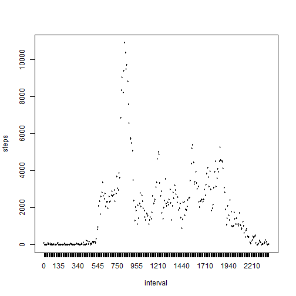
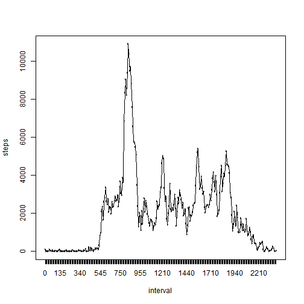
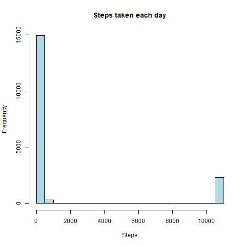
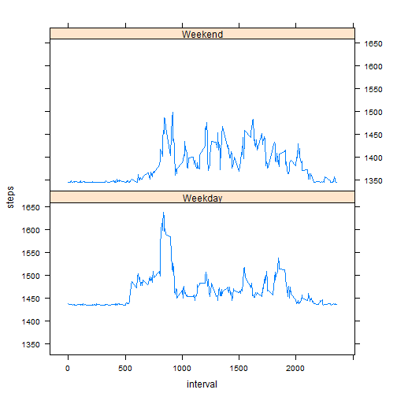

```r
knitr::opts_chunk$set(echo = TRUE)
```

## Loading and preprocessing the data

```r
activity <- read.csv("activity.csv")
activity$date <- as.Date(activity$date)
activity$steps <- as.numeric(activity$steps)
activity <- na.omit(activity)
```


## What is mean total number of steps taken per day?

```r
Totalsteps <- rowsum(activity$steps, activity$date, na.rm = TRUE)
Totalsteps <- as.table(Totalsteps)
Totalsteps <- as.data.frame(Totalsteps)
Totalsteps[2] <- Totalsteps[3]
names(Totalsteps) <- c("date", "steps")

hist(Totalsteps$steps, col="cyan", xlab = "Steps", main = "Steps taken each day")
```


```r
mean(Totalsteps$steps)
```

```
## [1] 10766.19
```

```r
median(Totalsteps$steps)
```

```
## [1] 10765
```


## What is the average daily activity pattern?

```r
Dailypattern <- rowsum(activity$steps, activity$interval, na.rm = TRUE)
Dailypattern <- as.table(Dailypattern)
Dailypattern <- as.data.frame(Dailypattern)
Dailypattern[2] <- Dailypattern[3]

names(Dailypattern) <- c("interval", "steps")

plot(Dailypattern$interval, Dailypattern$steps, type = "l", xlab = "interval", ylab = "steps")
```



```r
lines(Dailypattern$interval, Dailypattern$steps, type = "l", col="red")
```



```r
Dailypattern[Dailypattern$steps == max(Dailypattern$steps), ]
```

```
##     interval steps    NA
## 104      835 10927 10927
```


## Imputing missing values

```r
activity2 <- read.csv("activity.csv")
activity2$date <- as.Date(activity2$date)
activity2$steps <- as.numeric(activity2$steps)

sum(is.na(activity2$steps))
```

```
## [1] 2304
```

```r
activity2[is.na(activity2)] <- mean(Totalsteps$steps)

hist(activity2$steps, col="lightblue", xlab = "Steps", main = "Steps taken each day")
```



```r
mean(activity2$steps)
```

```
## [1] 1444.439
```

```r
median(activity2$steps)
```

```
## [1] 0
```

## Are there differences in activity patterns between weekdays and weekends?

```r
day <- weekdays(activity2$date) == "Saturday" | weekdays(activity2$date) == "Sunday"
day[day == FALSE] <- "Weekday"
day[day == TRUE] <- "Weekend"
activity2$dayoftheweek <- day
activity2average <- with(activity2, aggregate((steps), list(dayoftheweek, interval), mean))
colnames(activity2average) <- c("day", "interval", "steps")

library(lattice)
xyplot(steps ~ interval | day, data = activity2average, layout = c(1, 2), type = "l")
```


